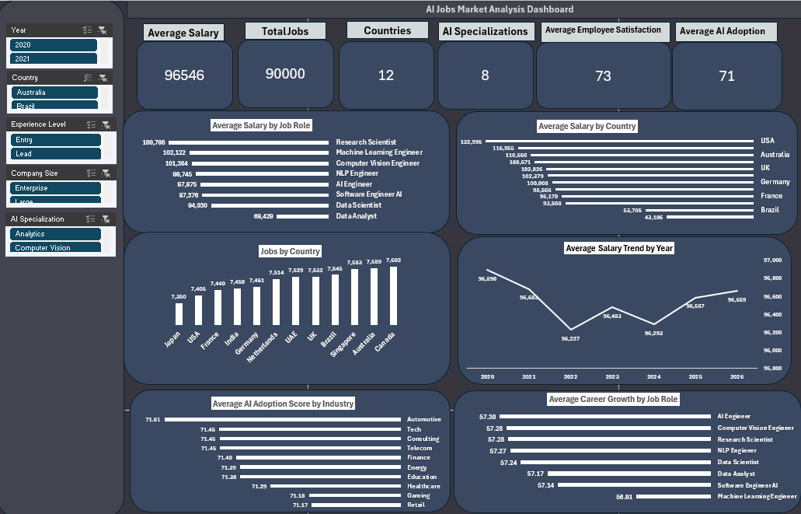
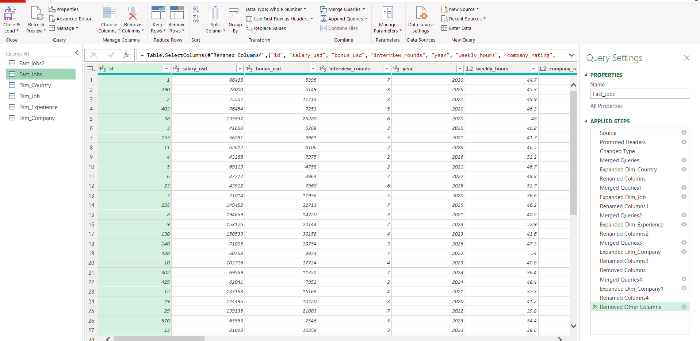
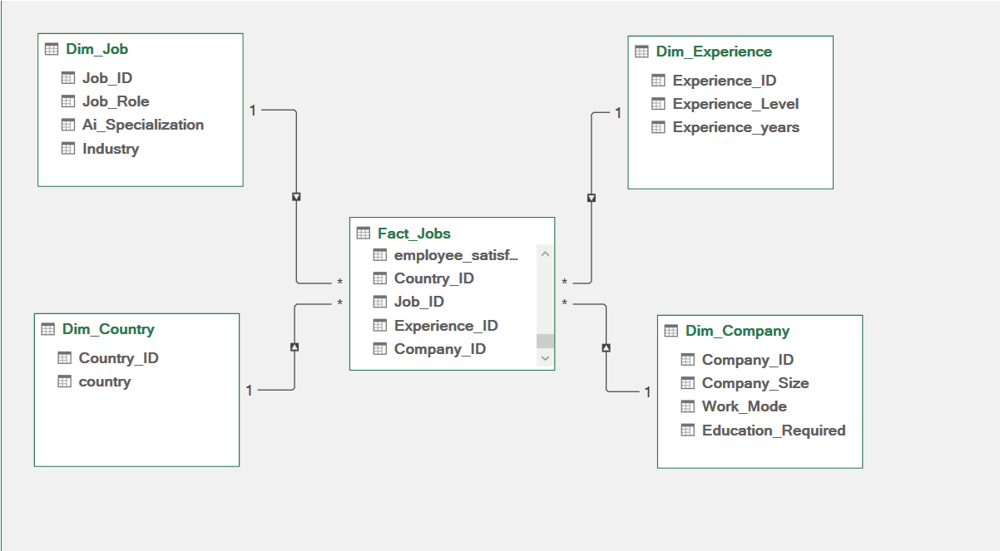
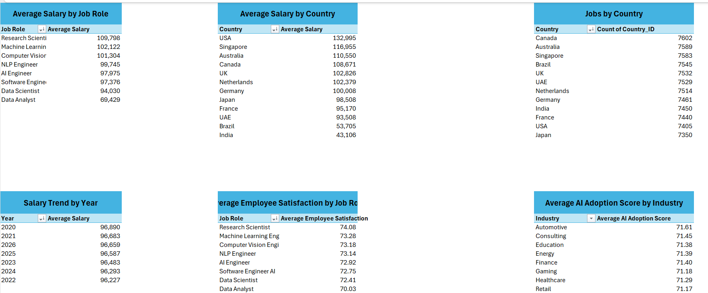
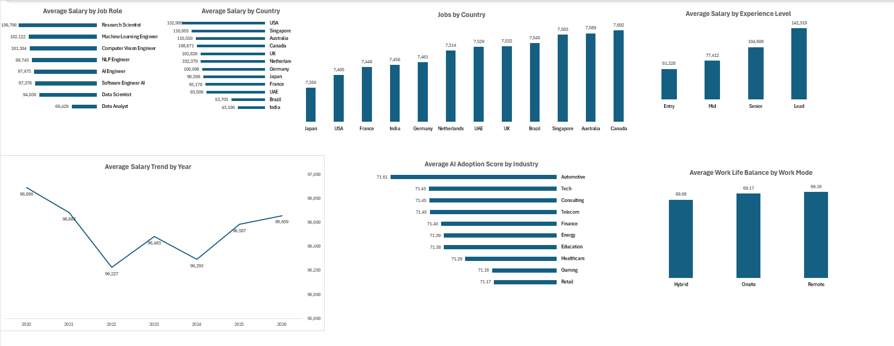

# 📊 AI Jobs Market Analysis Dashboard (Excel)

An end-to-end **Data Analysis** project built with **Microsoft Excel** to analyze the **Global AI Job Market**. This project demonstrates the complete analytics workflow, from data preparation to interactive dashboard development for business decision-making.

---

## ❓ Business Question

**How can Microsoft Excel be used to analyze the global AI job market and provide actionable insights into salaries, job distribution, AI specializations, experience levels, and workforce trends through an interactive dashboard?**

---

## 🎯 Project Objective

The objective of this project is to transform raw AI job market data into meaningful business insights by applying data cleaning, modeling, exploratory data analysis (EDA), and visualization techniques in Microsoft Excel. The final dashboard enables users to explore salary trends, workforce distribution, AI specialization demand, and work patterns through an interactive reporting experience.

---

## 🔄 Project Workflow

- Imported the dataset into Microsoft Excel
- Cleaned and transformed the data using Power Query
- Built a Star Schema data model using Power Pivot
- Performed Exploratory Data Analysis (EDA)
- Applied Excel functions for data analysis
- Created Pivot Tables and Pivot Charts
- Built an interactive dashboard using Slicers

---

## 📈 Dashboard Features

- Average Salary by Job Role
- Average Salary by Country
- Jobs by Country
- Average Salary Trend by Year
- Average Salary by Experience Level
- AI Adoption Score by Industry
- Work-Life Balance by Work Mode

---

## 🛠️ Tools & Technologies

- Microsoft Excel
- Power Query
- Power Pivot
- Pivot Tables
- Pivot Charts
- Slicers

---

## 🧮 Excel Functions Used

- XLOOKUP
- IFERROR
- COUNTIF
- SUMIF
- AVERAGEIF

---

## 📂 Dataset

This project uses the **Global AI Job Market Dataset** obtained from Kaggle.

The dataset includes:

- Job Roles
- Countries
- AI Specializations
- Company Size
- Experience Levels
- Salaries
- Employee Satisfaction
- AI Adoption Score
- Work-Life Balance
- Career Growth
- Industries

The dataset provides a realistic business scenario for data cleaning, data modeling, exploratory analysis, and interactive dashboard development.

> **Source:** Kaggle – Global AI Job Market Dataset

---

## 🖼️ Project Preview

### Dashboard

---

### Power Query

---

### Data Model

---

### Exploratory Data Analysis (EDA)

---

### Visualizations

---

### Excel Functions Used

---

## 💡 Key Insights

- Research Scientists have the highest average salary.
- The United States offers one of the highest average salaries.
- Lead-level professionals earn significantly more than other experience levels.
- AI adoption remains consistently high across industries.
- Remote work provides the highest work-life balance score.

---

## ⭐ Project Highlights

- Analyzed the global AI job market using Microsoft Excel
- Built a Star Schema data model
- Performed Exploratory Data Analysis (EDA)
- Applied advanced Excel functions for data analysis
- Developed interactive Pivot Tables and Pivot Charts
- Built a fully interactive dashboard using Slicers

---

## 👤 Author

**Saud Majrashi**

**Management Information Systems (MIS) Student at King Faisal University**

- LinkedIn: www.linkedin.com/in/saud-majrashi
